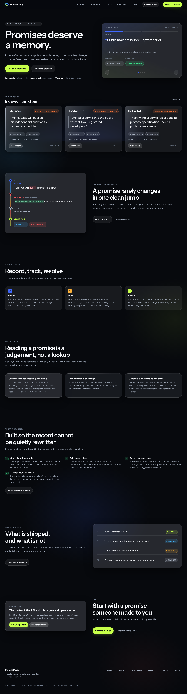
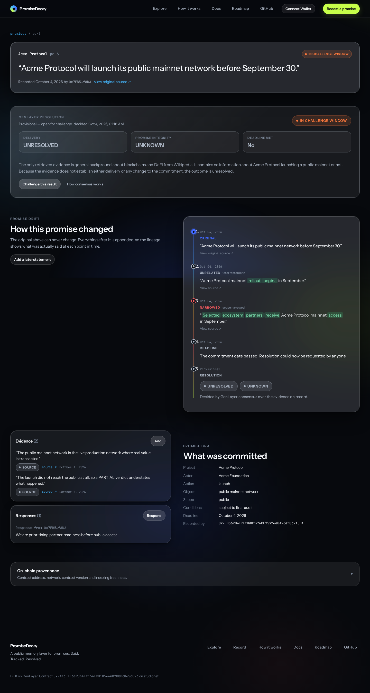
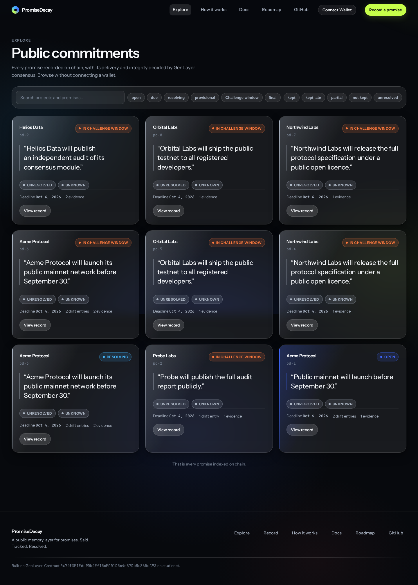
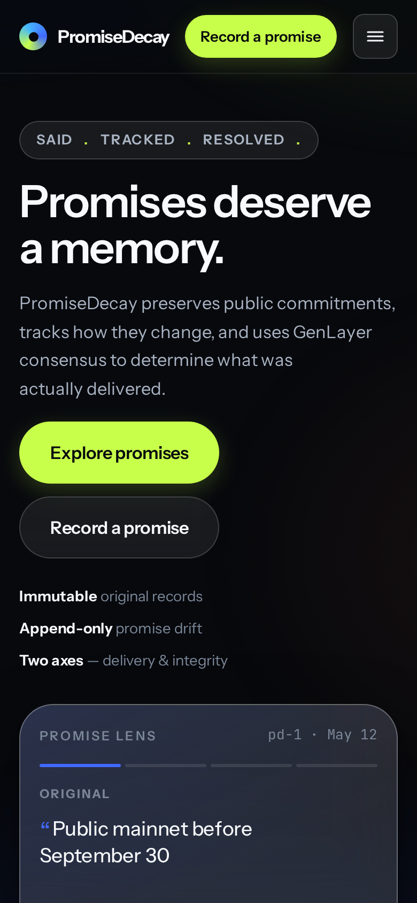
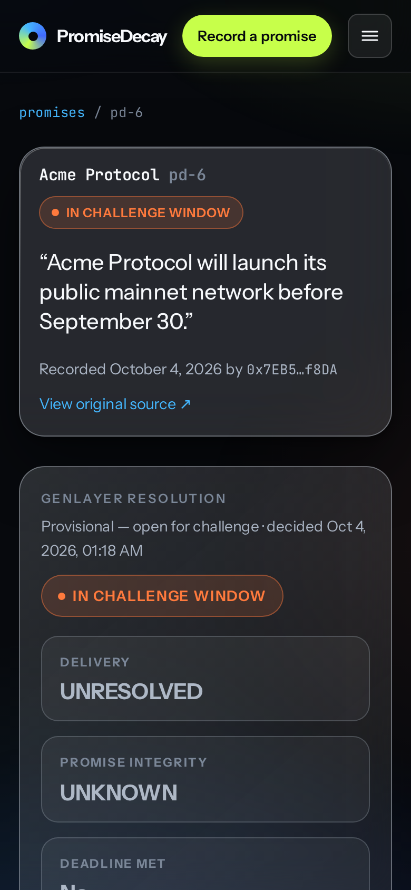

<div align="center">

# PromiseDecay

### Promises deserve a memory.

**Live:** [promisedecay.bydx.fun](https://promisedecay.bydx.fun) · **Docs:** [/docs](https://promisedecay.bydx.fun/docs)

*Said. Tracked. Resolved.*

</div>

---

## What this is

What exactly did a project promise, how did that promise change, and what was actually delivered?

Most commitments are made in public and then quietly edited. A launch date becomes "selected
partners". A mainnet becomes a "public mainnet" and then an "invitational mainnet". Nothing on
the internet is designed to remember that.

PromiseDecay preserves public commitments as immutable records, tracks how they change, and uses
[GenLayer](https://genlayer.com) consensus to determine what was actually delivered.

Three things are kept deliberately separate, because collapsing them is how accountability tools
become meaningless:

| | |
|---|---|
| **Original promise** | What was actually said, frozen at the moment it was recorded. |
| **Promise drift** | How later statements changed the wording, scope or intent. |
| **Resolution** | What the evidence shows was actually delivered. |

Delivery and integrity are two independent axes, never a single score:

- **Delivery** — `KEPT` · `KEPT_LATE` · `PARTIAL` · `NOT_KEPT` · `UNRESOLVED`
- **Integrity** — `UNCHANGED` · `NARROWED` · `REFRAMED` · `REVERSED` · `UNKNOWN`

> Public mainnet before September 30 → *selected ecosystem partners receive access in September*
> → `PARTIAL` delivery, `NARROWED` integrity

That arrow is an illustration of the shape of a finding, **not a verdict from the deployed
contract**. The public records currently on Studionet all resolve `UNRESOLVED` / `UNKNOWN` —
their evidence genuinely does not establish what happened, and the contract refuses to invent an
answer it cannot support. The example above is what a *supported* finding looks like when the
evidence actually shows it.

There is deliberately **no reputation score, no vote, no token, no staking and no ranking**. Users
supply evidence; validators reach semantic consensus; the record stays inspectable.

---

## Screens

These are screenshots of the deployed product, not mockups.

**Landing** — the Promise Lens reconstructs a promise's drift and resolution:



**Promise detail** — original quote first, drift lineage, evidence, and consensus resolution:



**Explore** — searchable, filterable, no wallet required:



**Mobile** — designed, not collapsed:

 

---

## Architecture

```
                 writes (user-signed, browser)
   ┌──────────┐   ─────────────────────────►   ┌──────────────────┐
   │  Browser │                                 │ GenLayer         │
   │  dApp    │   ◄─────────────────────────   │ Intelligent      │
   └────┬─────┘        reads (projected)        │ Contract         │
        │                                        └────────┬─────────┘
        │ API reads                                         │ finalized state
   ┌────▼─────────┐   read-only projection                  │
   │  Fastify API │◄──────────────────┐            ┌────────▼─────────┐
   │  (index/search)                 │            │  Indexer worker  │
   └────┬─────────┘                   │            │  (restart-safe)  │
        │                             │            └──────────────────┘
   ┌────▼─────────┐            ┌──────▼───────┐
   │  PostgreSQL  │◄───────────┤  GenLayer RPC│
   │  (Drizzle)  │            └──────────────┘
   └──────────────┘
```

Three rules the diagram is expressing:

1. **The contract is authoritative.** PostgreSQL is a projection — a search and read cache.
   Rebuilding it from scratch never changes a single byte of chain state.
2. **The backend never decides outcomes.** It has no signing key and no authority. Deleting the
   database and re-indexing reproduces the same product.
3. **The user signs every write.** Production writes go through the visitor's own wallet via
   `genlayer-js` and an EIP-1193 provider. There is no server-side signer.

| Package | Role |
|---|---|
| `apps/web` | React + Vite SPA, Living Glass design system |
| `apps/api` | Fastify + Zod + Pino read API |
| `apps/indexer` | Paced, restart-safe projection worker |
| `contracts/` | The GenLayer Intelligent Contract (Python) — the source of truth |
| `packages/domain` | Shared types and enums |
| `packages/config` | One place where all environment config is validated |

---

## The contract

Deployed on **GenLayer Studionet (chain 61999)**:

| | |
|---|---|
| **Contract** | `0x742210deAab5d1A45F68675b1Ed0be2f621671c5` |
| **Version** | `1.0.1` |
| **Deployment tx** | `0x27023d8d63f08f5359a6b688b02c87fd8d0c026d64909c7557e161b795ca3c00` |
| **Runtime pin** | `py-genlayer:1jb45aa8ynh2a9c9xn3b7qqh8sm5q93hwfp7jqmwsfhh8jpz09h6` |
| **Source sha256** | `32f6a82e0d46362d8c51bf584aa1eb89823e21f91c9e9540336c558e968a864b` |
| **Source commit** | `e070d2ee9e95cfd8ffa05252c9aeaaa41232ff72` |
| **Challenge window** | 7 days |

**Legacy V1 deployment** (`1.0.0`, superseded): `0x6B340D9C6230b31652aAbDC08acDAd763635A82b`. It still exists on chain and is untouched,
but it predates the decision-input and lifecycle fixes and is no longer read by this app. See
[docs/DEPLOYMENT.md](docs/DEPLOYMENT.md#deployment-history).

Why Python and GenLayer at all: deciding whether a public article supports the claim that a
mainnet launched is a question no amount of deterministic code can answer. It needs
non-deterministic access to the live web and LLM judgement inside a consensus mechanism — which
is exactly what an Intelligent Contract provides.

### Consensus

Judgement runs on **closed, structured decision fields**, not on generated prose, so validators can
legitimately disagree about wording without failing consensus:

```json
{
  "delivery": "PARTIAL",
  "integrity": "NARROWED",
  "deadline_met": true,
  "material_scope_change": true
}
```

Explanations are free text and only bounded in length. Every enum is validated *after* consensus
and before any persistent state is written, so malformed model output can never corrupt state.

### Prompt injection

Consensus is explicitly **not** treated as a prompt-injection defence — a hostile page can fool
every validator the same way. So defences are deterministic and happen *before* any non-determinism:

- Schemes restricted to `http`/`https`; `file:`, `data:`, `javascript:` rejected
- Credential-bearing URLs rejected; loopback, private and link-local literals rejected — including
  the octal form (`010.0.0.1`) that a naive parser reads as a hostname
- Ports, URL length, redirect count, page size and prompt size all bounded
- Source content confined between delimiters in a clearly separated **untrusted evidence** region,
  with an explicit instruction never to obey content inside it

The adversarial corpus lives in `tests/contract/test_prompt_injection.py`, and injection was also
exercised against the live deployment: the injected text was stored verbatim as *data* while the
consensus verdict was not forced.

---

## Running it locally

Requirements: Node 20+, pnpm 9+, Python 3.12+, PostgreSQL 14+.

```bash
git clone https://github.com/0xbardia/PromiseDecay.git
cd PromiseDecay

pnpm install
cp .env.example .env      # then fill in DATABASE_URL and the GenLayer values

# create the schema (idempotent — safe to re-run)
pnpm --filter @promisedecay/api migrate

# contract test tooling
python3 -m venv .venv && .venv/bin/pip install "genlayer-test==0.29.2" pytest
```

Then run the three processes:

```bash
pnpm --filter @promisedecay/api dev        # Fastify, port 4182
pnpm --filter @promisedecay/indexer dev    # projection worker
pnpm --filter @promisedecay/web dev        # Vite dev server
```

### Configuration

Every environment-dependent value comes from `.env`; nothing is hardcoded. The API validates the
whole file at boot and exits with a clear message naming the missing key rather than starting
half-configured. See [`.env.example`](.env.example) and [docs/DEPLOYMENT.md](docs/DEPLOYMENT.md).

**WalletConnect is optional.** PromiseDecay works with any injected EIP-1193 wallet and needs no
project ID. Browsing requires no wallet at all. Leave `VITE_WALLETCONNECT_PROJECT_ID` unset unless
you want WalletConnect's routing, and never commit a placeholder — a fake ID produces a confusing
connection failure rather than an honest absence.

---

## Testing

```bash
pnpm -r typecheck                       # all packages
pnpm --filter @promisedecay/api test    # 44 backend tests
pnpm --filter @promisedecay/web test    # 74 frontend + security tests

.venv/bin/pytest tests/contract         # 217 Direct Mode contract tests
```

Browser coverage runs against the **real deployed domain**, not localhost:

```bash
pnpm --filter @promisedecay/web exec playwright install chromium firefox webkit
pnpm --filter @promisedecay/web exec playwright test          # all three engines
pnpm --filter @promisedecay/web screenshots                    # visual QA captures
```

Contract tests use `genlayer-test` in Direct Mode with mocked web and LLM responses, covering the
full lifecycle, immutability, bounds, URL rules, every delivery and integrity state, challenge
timing, malformed model output, validator agreement and disagreement, prompt injection, and storage
serialization.

---

## Security

Reviewed and documented in [docs/SECURITY_FINDINGS.md](docs/SECURITY_FINDINGS.md) — **0 open
Critical, 0 open High**.

> This is an internal **security review** of our own code, not an independent audit. No third party
> has examined this codebase. Treat it as a self-assessment with its limitations stated.

Defences in place: strict URL allow-listing before non-determinism; no `dangerouslySetInnerHTML`
anywhere; parameterised SQL via Drizzle; origin-exact CORS; request and body limits; rate limiting;
CSP, HSTS, `nosniff`, `Referrer-Policy`, `Permissions-Policy` and `DENY` framing; structured logging
with no secret or key material. Report anything you find via [SECURITY.md](SECURITY.md).

---

## Roadmap

**V1 — Public Promise Memory** · shipped: immutable records, Promise Drift, evidence, response,
semantic GenLayer resolution, challenge window, project history, search, wallet signing, public docs.

**V1.1** — stronger project identity verification, watchlists, richer evidence provenance, share cards.
**V1.2** — notifications, organisation histories, source monitoring.
**V2** — Promise Graph, composable commitment history, downstream reputation primitives.

Future work is never marked shipped. See [promisedecay.bydx.fun/roadmap](https://promisedecay.bydx.fun/roadmap).

---

## Documentation

[Product](docs/PRODUCT.md) · [Architecture](docs/ARCHITECTURE.md) · [Contract](docs/CONTRACT.md) ·
[Consensus](docs/CONSENSUS.md) · [API](docs/API.md) · [Security](docs/SECURITY.md) ·
[Threat model](docs/THREAT_MODEL.md) · [Security findings](docs/SECURITY_FINDINGS.md) ·
[Testing](docs/TESTING.md) · [Deployment](docs/DEPLOYMENT.md) · [Roadmap](docs/ROADMAP.md)

---

## License

[MIT](LICENSE) © PromiseDecay contributors
